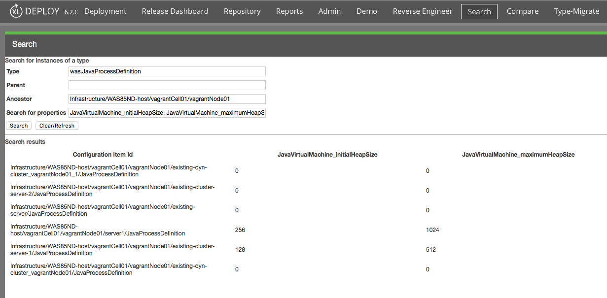

# XL Deploy repository search plugin #

## CI status ##

[![Build Status][xld-repo-search-plugin-travis-image]][xld-repo-search-plugin-travis-url]
[![License: MIT][xld-repo-search-plugin-license-image] ][xld-repo-search-plugin-license-url]
[![Github All Releases][xld-repo-search-plugin-downloads-image] ]()

[xld-repo-search-plugin-travis-image]: https://travis-ci.org/xebialabs-community/xld-repo-search-plugin.svg?branch=master
[xld-repo-search-plugin-travis-url]: https://travis-ci.org/xebialabs-community/xld-repo-search-plugin
[xld-repo-search-plugin-license-image]: https://img.shields.io/badge/License-MIT-yellow.svg
[xld-repo-search-plugin-license-url]: https://opensource.org/licenses/MIT
[xld-repo-search-plugin-downloads-image]: https://img.shields.io/github/downloads/xebialabs-community/xld-repo-search-plugin/total.svg

## Usage ##

1. Install the plugin JAR file in the xl-deploy-server/plugins directory.
2. Restart the XL Deploy server.
3. The main menu will display Search at the top-level.
4. Enter a type defined to XL Deploy's type system.  See the [documentation](https://docs.xebialabs.com/xl-deploy/6.2.x/) for type names.
5. Enter a Parent to search the level immediately under a container.
6. Or, enter an Ancestor to search all levels under a container.
7. Enter the properties to display as a comma-separated list.

## Example ##

